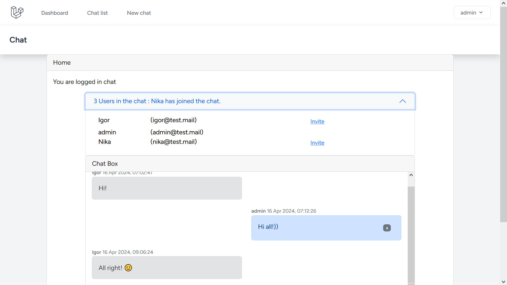
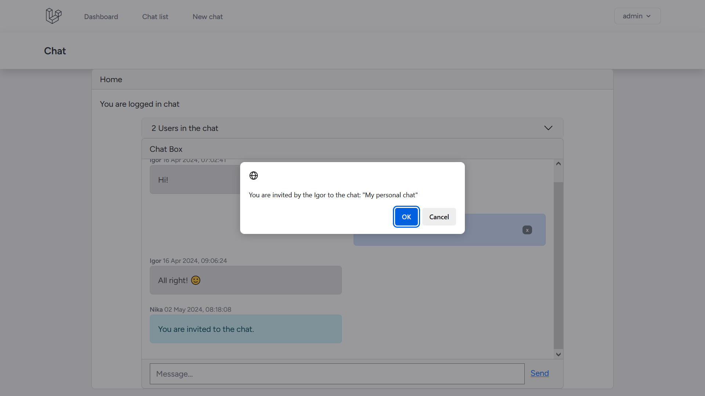

<p align="center"><a href="https://laravel.com" target="_blank"></a></p>


## Laravel 11 Live Chat, React SPA with Pusher.

The system must first have the necessary components installed: composer, git, docker. PHP version ^8.2  

Commands init application:

```
> cd /path_to_projects
> git clone https://github.com/Igor-ad/laravel-live-chat.git
> cd ./laravel-live-chat
> cp ./.env.example ./.env

```

It is necessary to fill in the parameters of the environment file ./.env with the following values:
DB_PASSWORD,
PUSHER_APP_ID,
PUSHER_APP_KEY,
PUSHER_APP_SECRET,

```
> composer install
> ./vendor/bin/sail up
> chmod 777 -R ./storage/logs
> chmod 777 ./storage/framework/views
> php artisan key:generate
> php artisan migrate
> npm install 
> npm run build
> php artisan queue:listen

```

#### Main features of Laravel-live-chat:
1. Create a public/private chat;       
2. Soft deletion of your own chats;
3. Ability to choose your own or public chat;
4. Sending and soft deleting your own chat messages;
5. Smooth scrolling of the message feed when receiving a new message in the chat;
6. Sending a pop-up message with an invitation to a public/private chat for the user on any page of the site;
7. Collapse/expand the panel with users authorized in to the site;
8. Chat status bar, which displays chat events;
9. Standard profile page for changing user registration data (Breeze);
10. Standard check of the user mailbox during registration;
11. CSRF protection of post/delete requests.

#### Functions for displaying events in the chat status bar:
1. Number of online users in the current chat;
2. User login/logout from the site;
3. User entry/exit from the current chat;
4. Typing the message text by the user;
5. Erasing the message text by the user;
6. Display the text of a message deleted by the user;
7. Creation/deletion of a chat by the user;
8. Clear status bar after 10 seconds.

##### Examples of web pages






The application has also been successfully tested with the latest version of Laravel Reverb as a WebSockets server.
The settings in the .env and echo.js files need to be changed to match the Reverb server.
You also need to install dependencies to work with the Reverb server.
